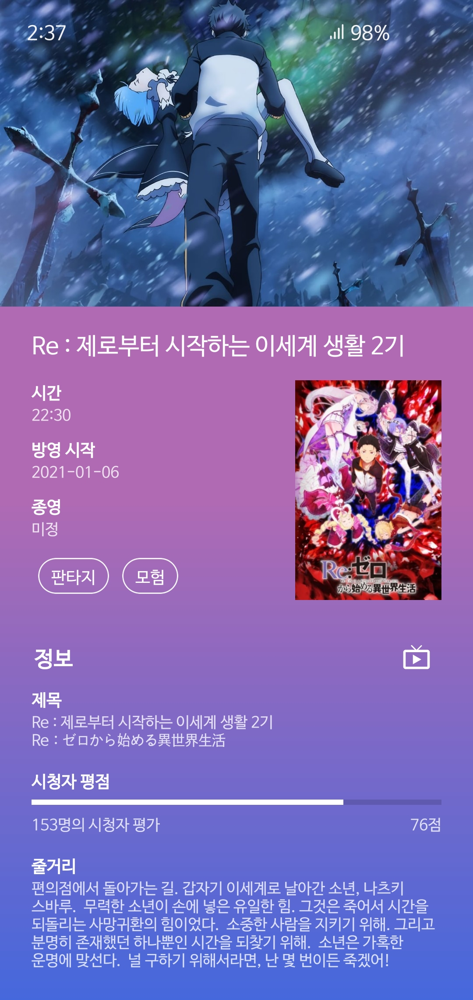
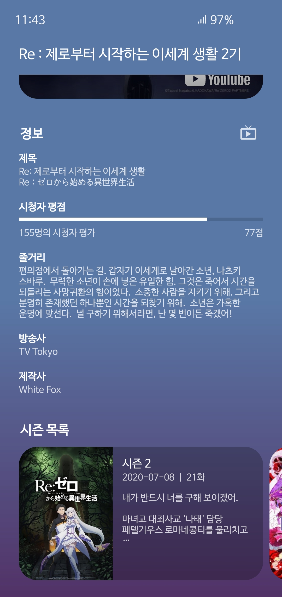

# AniSched-Android
## 개발 진행 중 (진행도는 [여기](https://github.com/qkdxorjs1002/AniSched-Android/projects/1))

   현재 Icon 없음

  

    

  

### 애니메이션 편성표 앱 (애니시아 API, TMDb)
  

  

## 다운로드
### API 23 (Marshmallow / 6) 이상 지원
  
위 링크에서 앱을 다운로드 할 수 있습니다.
  

## 기능
 - 요일별, 신작 / 외전 편성표 목록
 - 작품의 방영 정보와 이미지, 줄거리 및 시청자 평가 등 상세 정보
 - 작품의 실시간 자막 정보
 - 그 외 [추가 예정](https://github.com/qkdxorjs1002/AniSched-Android/projects/1)
  

## 사용된 API
 - [애니시아](https://anissia.net/) API
 - [TMDb](https://www.themoviedb.org/) API
 